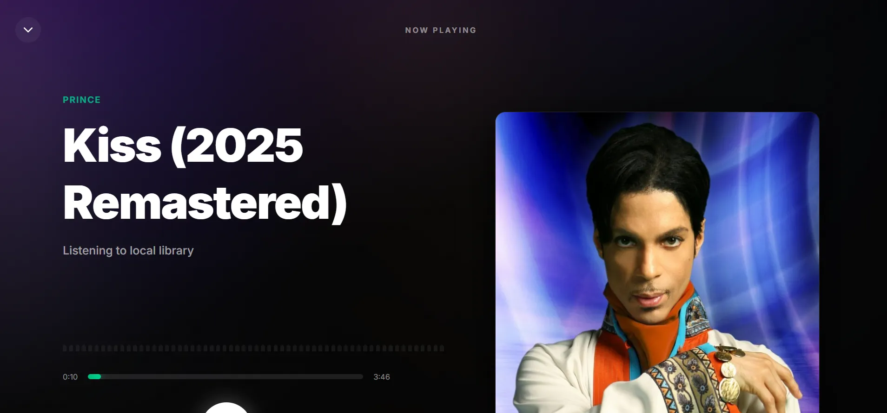
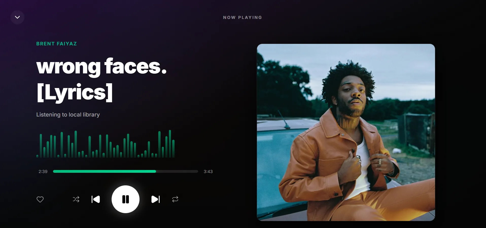
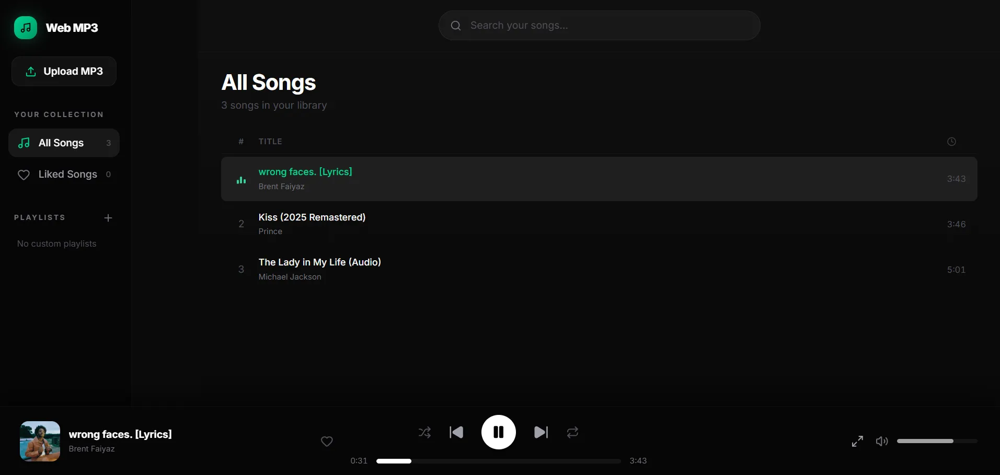

# 🎵 Web-Based Music Player



A stunning, responsive, and performant web-based music player built with modern web technologies. This application allows users to upload local MP3 files, organize them into custom playlists, and enjoy a premium playback experience featuring a dynamic full-screen "Now Playing" interface.

---

## ✨ Features

- **Local Playback via `URL.createObjectURL`**: Upload and play local audio files instantly without the need for a backend database. The player leverages browser memory for high-performance audio streaming.
- **Dynamic "Now Playing" View**: A breathtaking full-screen overlay that dynamically adapts its gradient background based on the current track's album art, complete with a simulated audio visualizer.
- **Automated Metadata Fetching**: Seamlessly integrates with **TheAudioDB API** to automatically fetch high-quality album and artist artwork based on the uploaded file's metadata.
- **Custom Playlists & Liked Songs**: Create unlimited custom playlists or heart your favorite tracks to easily access them later.
- **Advanced Audio Controls**: Features a true randomized shuffle queue, repeat modes (track/all), volume control, and precise seeking.
- **Fully Responsive Design**: Whether you're on a 4K monitor or a smartphone, the UI adapts beautifully. Mobile users get a streamlined "Mini Player" that expands into the full experience with a single tap.

---

## 🛠️ Tech Stack

- **Framework**: React 18 (with TypeScript)
- **Build Tool**: Vite
- **Styling**: Tailwind CSS (with custom CSS variables and keyframes)
- **Icons**: Lucide React
- **State Management**: React Hooks (`useState`, `useEffect`, `useRef`)

---

## 📸 Gallery

<div align="center">
  
  
</div>

---

## 🚀 Getting Started

### Prerequisites
Make sure you have Node.js (v16 or higher) installed on your machine.

### Installation

1. **Clone the repository:**
   ```bash
   git clone https://github.com/mike-gaingob/react-web-based-mp3-music-player.git
   cd react-web-based-mp3-music-player
   ```

2. **Install dependencies:**
   ```bash
   npm install
   ```

3. **Run the development server:**
   ```bash
   npm run dev
   ```

4. **Open in Browser:**
   Navigate to `http://localhost:5173` to start listening!

---

## 📖 How It Works

### TheAudioDB API Integration
When an MP3 file is uploaded, the application parses the filename (e.g., `Artist - Title.mp3`) and sends a background request to the free, public tier of **TheAudioDB API**. 
If a match is found, the API returns a high-quality image URL which is then seamlessly injected into the UI for a rich, visual experience.

### Local File Handling (`URL.createObjectURL`)
To ensure maximum privacy and zero latency, this application does **not** upload your music to a remote database. Instead, it uses the browser's native `URL.createObjectURL()` method. 
When you drop an MP3 file into the app, the browser creates a temporary, highly-optimized reference URL directly to the file in your computer's memory. This allows the `<audio>` element to stream the file instantly.

> **Note:** Because files are stored in session memory, refreshing the page will clear your current library.

---

## 📈 Scaling Options & Future Upgrades

While the current architecture is perfect for a lightweight, in-browser session player, it is designed with extensibility in mind. Here are clear paths for scaling the application:

1. **Persistent Local Storage (IndexedDB)**
   To persist files across page reloads without a backend, the `File` objects can be serialized and stored natively in the browser using **IndexedDB**. This would allow users to return to their library days later without needing to re-upload.

2. **Backend Database Integration**
   The architecture strictly separates the UI from the data layer (`useMusicLibrary.ts`). To upgrade to a cloud-based player (e.g., AWS S3 + PostgreSQL or Firebase), the local state management can easily be swapped for API calls that handle persistent cloud uploads and authentication, allowing users to access their library from any device.

3. **Web Audio API**
   The current visualizer is a beautiful simulation. By hooking the `<audio>` element into the true **Web Audio API AnalyserNode**, the visualizer can be upgraded to react to the actual frequencies and beats of the currently playing track.

---

## 📝 License
This project is open-source and available under the MIT License.
